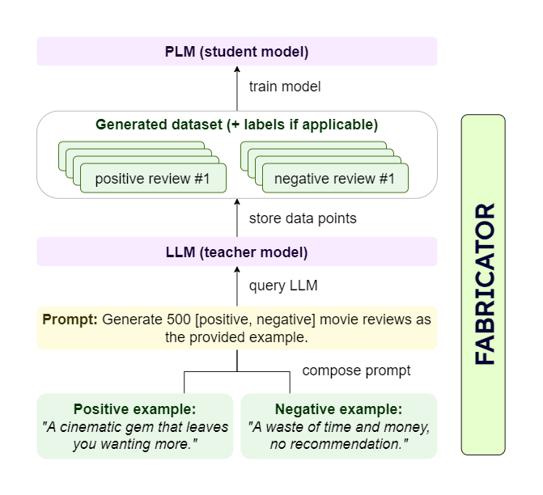

# Tutorial 1: Fabricator Introduction

## 1) Dataset Generation

### 1.1) Recipe for Dataset Generation 📚
When starting from scratch, to generate an arbitrary dataset, you need to implement some instance of:

- **_Datasets_**: For few-shot examples and final storage of (pair-wise) data to train a small PLM.
- **_LLMs_**: To annotate existing, unlabeled datasets or generate completely new ones.
- **_Prompts_**: To format the provided inputs (task description, few-shot examples, etc.) to prompt the LLM.
- **_Orchestrator_**: To aligns all components and steer the generation process.

### 1.2) Creating a Workflow From Scratch Requires Careful Consideration of Intricate Details 👨‍🍳
The following figure illustrates the typical generation workflow when using large language models as teachers for
smaller pre-trained language models (PLMs) like BERT. Establishing this workflow demands attention to implementation
details and requires boilerplate. Further, the setup process may vary based on a particular LLM or dataset format.

<figure>
    
    <figcaption>The generation workflow when using LLMs as a teacher to smaller PLMs such as BERT.</figcaption>
</figure>

### 1.3) Efficiently Generate Datasets With Fabricator 🍜 

With fabricator, you simply need to define your generation settings,
e.g. how many few-shot examples to include per prompt, how to sample few-shot instances from a pool of available 
examples, or which LLM to use. In addition, everything is built on top of Hugging Face's 
[datasets](https://github.com/huggingface/datasets) library that you can directly 
incorporate the generated datasets in your usual training workflows or share them via the Hugging Face hub.

## 2) Fabricator Compoments

### 2.1) Datasets

Datasets are build upon the `Dataset` class of the huggingface datasets library. They are used to store the data in a 
tabular format and provide a convenient way to access the data. The generated datasets will always be in that format such
that they can be easily integrated with standard machine learning frameworks or shared with the research community via 
the huggingface hub.

```python
from datasets import load_dataset

# Load the imdb dataset from the huggingface hub, i.e. for annotation
dataset = load_dataset("imdb")

# Load custom dataset from a jsonl file
dataset = load_dataset("json", data_files="path/to/file.jsonl")

# Share generated dataset with the huggingface hub
dataset.push_to_hub("my-dataset")
```

### 2.2) LLMs
We simply use haystack's `PromptNode` as our LLM interface. The PromptNode is a wrapper for multiple LLMs such as the ones
from OpenAI or all available models on the huggingface hub. You can set all generation-related parameters such as 
temperature, top_k, maximum generation length via the PromptNode (see also the [documentation](https://docs.haystack.deepset.ai/docs/prompt_node)).

```python
import os
from haystack.nodes import PromptNode

# Load a model from huggingface hub
prompt_node = PromptNode("google/flan-t5-base")

# Create a PromptNode with the OpenAI API
prompt_node = PromptNode(
    model_name_or_path="text-davinci-003",
    api_key=os.environ.get("OPENAI_API_KEY"),
)
```

### 2.3) Prompts

The `BasePrompt` class is used to format the prompts for the LLMs. This class is highly flexible and thus can be 
adapted to various settings:
- define a `task_description` (e.g. "Generate a [_label_] movie review.") to generate data for certain class, e.g. a movie review for the label "positive".
- include pre-defined `label_options` (e.g. "Annotate the following review with one of the followings labels: positive, negative.") when annotating unlabeled datasets.
- customize format of fewshot examples inside the prompt

#### Prompt for generating plain text

```python
from fabricator.prompts import BasePrompt

prompt_template = BasePrompt(task_description="Generate a movie review.")
print(prompt_template.get_prompt_text())
```
Prompt during generation:
```console
Generate a movie reviews.

text: 
```

#### Prompt for label-conditioned generation with label options

```python
from fabricator.prompts import BasePrompt

label_options = ["positive", "negative"]
prompt_template = BasePrompt(
    task_description="Generate a {} movie review.",
    label_options=label_options,
)
```

Label-conditioned prompts during generation:
```console
Generate a positive movie review.

text:
---

Generate a negative movie review.

text: 
---
```

<ins>Note:</ins> You can define in the orchestrator class the desired distribution of labels, e.g. uniformly 
sampling from both labels in the examples in each iteration.

#### Prompt with few-shot examples

```python
from datasets import Dataset
from fabricator.prompts import BasePrompt

label_options = ["positive", "negative"]

fewshot_examples = Dataset.from_dict({
    "text": ["This movie is great!", "This movie is bad!"],
    "label": label_options
})

prompt_template = BasePrompt(
    task_description="Generate a {} movie review.",
    label_options=label_options,
    generate_data_for_column="text",
)
```

Prompts with few-shot examples during generation:
```console
Generate a positive movie review.

text: This movie is great!

text: 
---

Generate a negative movie review.

text: This movie is bad!

text: 
---
```

<ins>Note:</ins> The `generate_data_for_column` attribute defines the column of the few-shot dataset for which additional data is generated.
As previously shown, the orchestrator will sample a label and includes a matching few-shot example.

### 2.4) DatasetGenerator

The `DatasetGenerator` class is fabricator's orchestrator. It takes a `Dataset`, a `PromptNode` and a 
`BasePrompt` as inputs and generates the final dataset based on these instances. The `generate` method returns a `Dataset` object that can be used with standard machine learning
frameworks such as [flair](https://github.com/flairNLP/flair), deepset's [haystack](https://github.com/deepset-ai/haystack), or Hugging Face's [transformers](https://github.com/huggingface/transformers).

```python
from fabricator import BasePrompt, DatasetGenerator

prompt_template = BasePrompt(task_description="Generate a movie review.")

prompt_node = PromptNode("google/flan-t5-base")

generator = DatasetGenerator(prompt_node)
generated_dataset = generator.generate(
    prompt_template=prompt,
    max_prompt_calls=10,
)
```

In the following [tutorial](TUTORIAL-2_GENERATION_WORKFLOWS.md), we introduce the different generation processes covered by fabricator.
